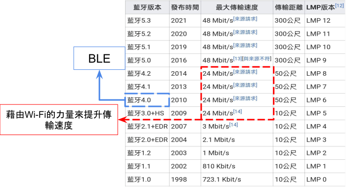
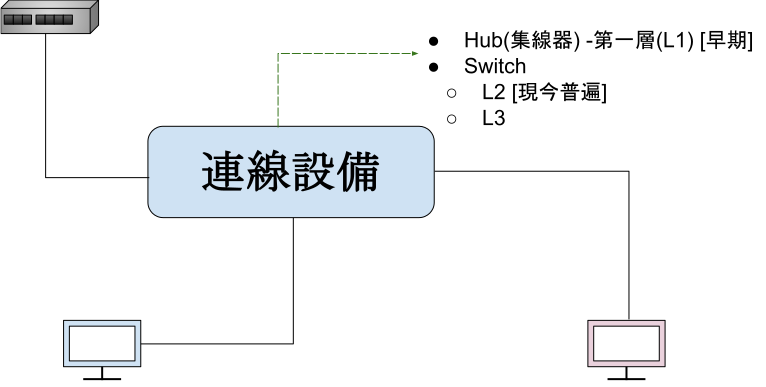
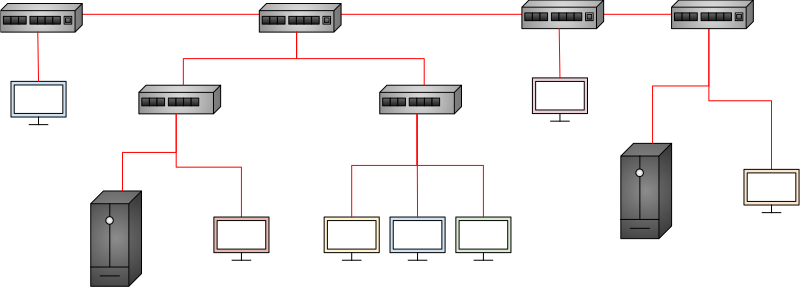
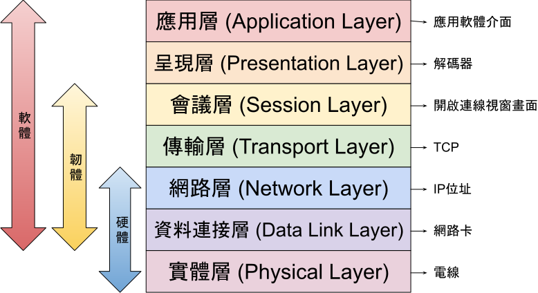

# Chapter 1 - 網路初探

## 前言
* 明文(plain text):未經加密處理，用於早期資訊共享年代
* 密文(enerypted text):經加密處理，用於現代商業活動頻繁的網路年代

## Internet
* 集中式架構:容易控制與管理，但若中間設備損壞就會無法使用

* 分散式架構:即使任一台設備損壞，也不影響其他設備，但不易管理

## Internet之用途
* 電子傳遞 E-mail
* 遠端使用 Telnet : 在本地端操控遠方的機器
    * SSH Port number=22 (有加密)
    * 雲端:計算(compute)、儲存(storage)、網路(network)
* 檔案傳輸 FTP : 重新連線時檔案可續傳
    * FTP Port number=21 (較不安全)
    * SFTP Port number=22 (有加密，現今較常用)
電子支付 : 
* QRcode:速度慢，但應用廣泛
* NFC(Near-field communication):速度快，但設置成本較高
* 社交媒體、網路電話、影音平台、電子商務, etc.

## 網路類型
* 身體感測網路BAN (Body Area Network)
    * 可穿戴或可嵌入的裝置
* 個人網路 PAN (Personal Area Network)
    * 有線 : USB電纜
    * 無線 : 藍牙、紅外、NFC
    
* 區域網路 LAN (Local Area Network)
    * 有線 : 乙太網路 (Ethernet)
    * 無線 WLAN (Wireless Local Area Network) : Wi-Fi 
        * wifi 4 : 802.11n 
        * wifi 5 : 802.11ac
        * wifi 6 : 802.11ax 
        * wifi 7 : 802.11be
* 都會網路 MAN  (Metropolitan Area Network)
    * 通常橫跨一個城市或城鎮的多個建築，LAN和WAN技術越來越強，許多MAN逐漸被取代
* 廣域網路 WAN (Wide Area Network)
    * 有線 : 第四台(cable)、光纖(FTTH)、ADSL
    * 無線 WWAN: 1G~5G

## 通訊方式
* 單波 (unicast) : 一對一
* 多播 (multicast) : 一對多，例 : radio
* 廣播 (bordcast) : 一對多，例 : 課堂老師說話

## 網路拓樸 Topology
* 星型網路(Star) : 和其他裝置斷線不影響其他

* 匯流排網路(Bus)

* 環形網路(Ring) : 把直線型兩端接起來
    * 優 : 廣播容易，不會產生碰撞，適合Token Ring
    * 缺 : 安全性低、斷一點全掛、擴展性差  
    *  **雙環型(Aual-ring)** : 避免損壞，打造出一個高可用(High-Availability,HA)的線路。環形雖然方便，但由於造價昂貴，以致當時LAN多用匯流排

* 樹狀網路(Tree) : 將多個star連接再一起，某點到某點只有一條路徑(亦可定義為loop-free 無迴圈)
    * 優 : 管理能力好、擴展性好
    * 缺 : 斷一點就掛

* 混合網路(Hybird) : 由多種架構(Bus, Tree, and Star)混合而成

## 網路作業環境
* 主從式架構 (Client-Server)
    * 以www為例，當客戶端(瀏覽器)輸入URL網址時，網頁伺服器會回傳網站首頁
    * Client : Browser
    * Server : IIS、Apache、nginx

* 對等式架構 P2P (Peer-to-Peer)
    * peer : 同時具有伺服器(Server)和客戶端(Client)的身份，可以請求別人亦可提供服務
    * 例 : 網路芳鄰、Windows共用中心

## OSI參考模型
