# Chapter 2 - 基本通訊概念

## 通訊傳輸方式
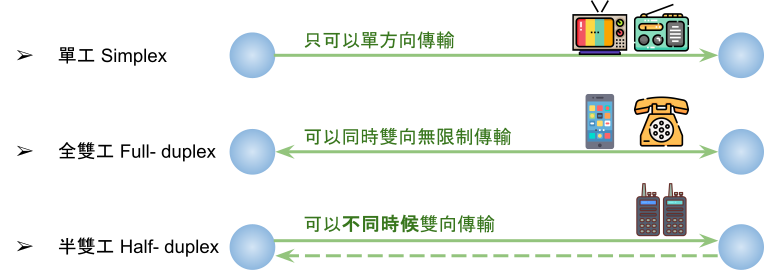

## 傳輸訊號
* 類比訊號 Analog Signal : 自然界連續訊號
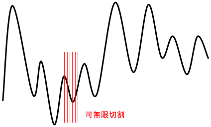
* 數位訊號 Digital Signal : 電腦內高低訊號

* 訊號三要素 : 大小(振幅)、頻率、相位

## 調變與解調變 Modulation & Demodulation
* 調變 : 傳送端(Transmitter)將訊號搬到一個不會與其他訊號衝突的範圍
* 解調變 : 接受端(Receiver)收到調變訊號候，經過處理將原來的訊號還原回來
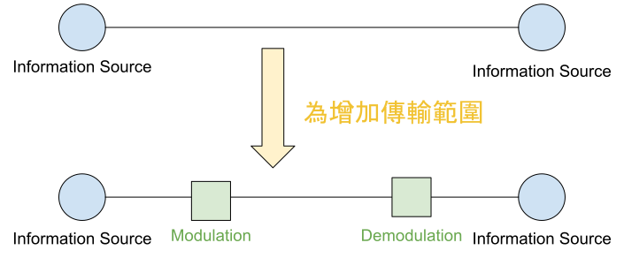
* AM : 調整幅度
* FM : 調整頻率
* PM : 調整相位

## 訊號傳輸
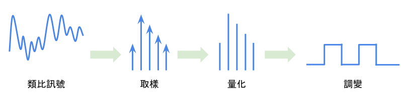
* Step 1 - 取樣
    * 將連續時間性訊號在時間上切割
    * 採樣次數愈密，所得訊號和原始訊號就會愈近似
    * 取樣頻率通常是最高頻率的兩倍
* Step 2 - 量化
    * 針對Y軸(在震幅做切割)
    * 量化層級愈多，取得訊號品質愈好，但所占記憶體量愈大
* Step 3 - 調變(PCM)
    * 將量化資料進行數位化處理
    * 人聲 8000(samples/sec)×8(bit/samples)=64(Kbps)
* 編碼處理 : 使數位訊號的傳輸更有效率，及達到同步處理的目的
    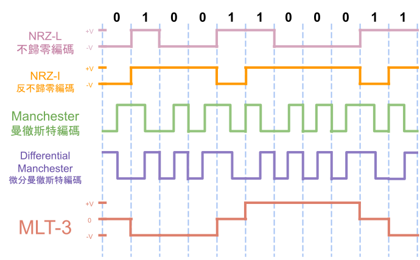
    * NRZ-L : 0在-V 位置；1在+V位置
    * NRZ-I : 遇0不變；遇1翻轉(-V→+V或+V→-V)
    * Manchester : 0是左下右上；1是左上右下
    * Differential Manchester : 遇0不變；遇1翻轉 
    * MLT-3 : 遇0不變；遇1往下一個走
        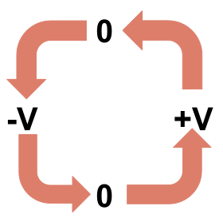

## 多工處理
* 分頻多工 FDM
    * Frequency Division Multiplexing
    * 在頻率上進行多工處理
    * 將傳輸的通道切割成許多子通道
    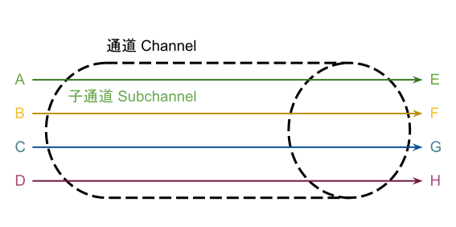
* 分時多工 TDM
    * Time Division Multiplexing
    * 在時間上進行多工處理
    * 將時間分割澄許多slot給大家輪流使用
    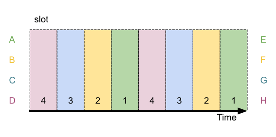
* 分碼多工 CDM
    * Code Division Multiplexing
    * 將訊號轉換成一連串數碼
    * 具有互不干擾的特性
    * 不同的人同時使用不同的編碼進行傳輸

## 通訊交換
* 電路交換 Circuit Switching
    * 優 : 不被干擾
    * 缺 : 使用率(Link-utilization)較低 (可能會有閒置情況)
    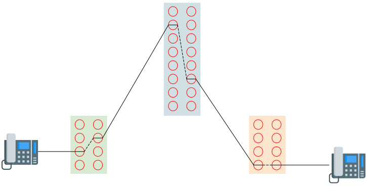
* 分封交換 Packet Switching
    * 優 : 使用率(Link-utilization)較高
    * 缺 : 使用率高時可能會發生碰撞，影響傳輸品質、延遲較高
    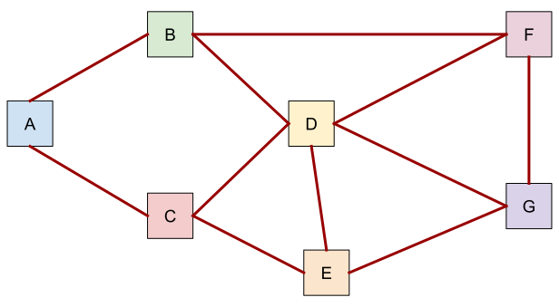
* 訊息交換 Message Switching
    * 各交換節點將收到的訊息先儲存起來，完整收到後，再往下傳
    * 儲存與轉送 Store and Forward
    * 優：成本費用較低、傳輸通道使用率高。
    * 缺：儲存需求高、延遲高。
    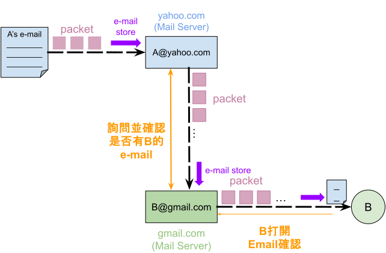

## xDSL
* 數位用戶線路 DSL (Digital Subscriber Line)
    * 以其既原有低成本雙絞銅線為基礎所架構高速網路傳送的一種技術
* xDSL家族
    * 非對稱數位用戶線路 ASDL (Asymmetric Digital Subscriber Line)
    * 通常上行速度較低；下行速度較高
    * 為目前xDSL家族最普遍之架構
    * 傳送距離會影響傳輸速度
    * 可能會漸漸被光纖(都市地區)或5G(偏遠地區)取代
