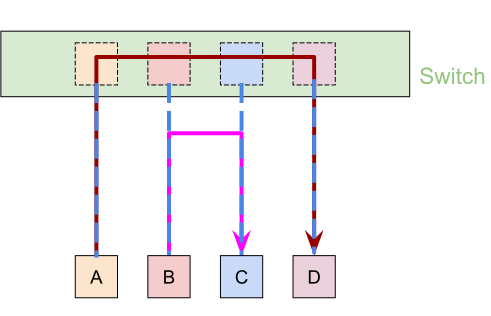
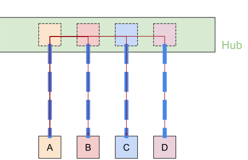
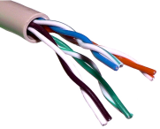
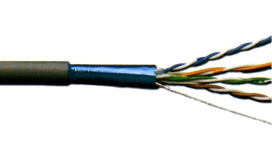
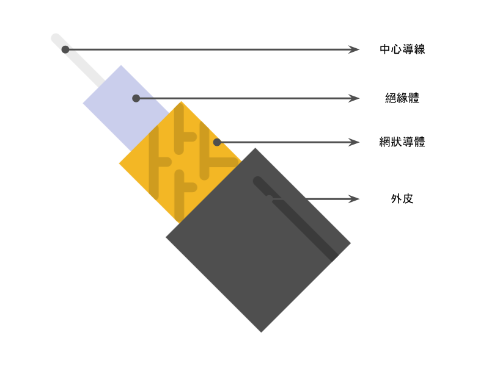
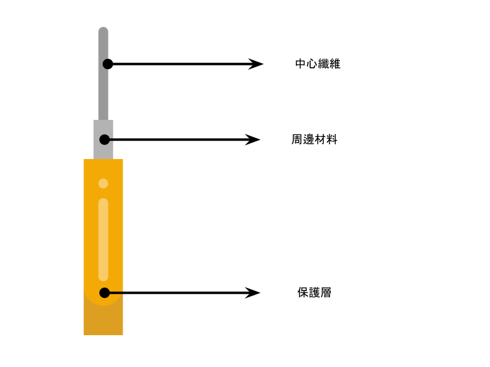
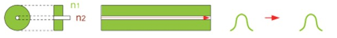
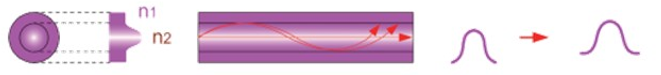
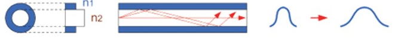

# Chapter 3 - 傳輸媒介與配備

## Switch & Hub

| | 交換器 Switch | 集線器 Hub |
|:---:|:---:|:---:|
| 層級 | Layer 2 (資料鏈接層 Data Link Layer) |Layer 1 (實體層 Physcial Layer)|
| 圖示 |  |  |
| 路徑 | ✔ : A → D 、 B → C ✘ : A → B 、 A → C | A → D 、 A → B 、 A → C
| 優點 | 安全性好、效能高、避免碰撞 | 價格較低、即插即用
| 缺點 | 價格較高 | 安全性差、效能差

## 雙絞線 Twisted Pair
* 互絞是為了避免電磁干擾(電生磁，磁生電)，防止串音
* 內部有八條線，兩兩絞在一起
* 無遮蔽雙絞線 UTP (Unshielded Twisted Pair)

* 遮蔽雙絞線 STP (Shielded Twisted Pair)

* 雙絞線等級 : 分為Category I ~ VII
    | 類別 | 互絞程度 | 傳輸速率 | 用途 |
    |:---:|:---:|:---:|:---:|
    | Cat1 | 未絞線 | 1~2 MHz | 基本語音通訊 |
    | Cat2 |  | 4 MHz | 4Mbps記號環網路 |
    | Cat3 | 每英吋絞3次 | 16MHz | 10BaseT、16Mb記號環網路 |
    | Cat4 |  | 20 MHz | 100BaseT4、16Mbps記號環網路 |
    | Cat5 | 每英吋絞5次 | 100 MHz | 100BaseT、100CDDI網路 |
    | Cat5增強型 |  | 200~300 MHz | ATM網路(OC-3) | 
    | Cat6 |  | 350~600 MHz | Gigabit Ethernet |
    | Cat7 |  | 600 Mbps | 10G Ethernet |

## 同軸電纜線 Coaxial Cable
* 用在匯流排(Bus)結構
* 現今已經逐漸被取代

## 光纖 Optical Fiber

* 傳輸距離長、安全性好、無輻射、低干擾、頻寬大、年限久
* 單膜光纖 Single Mode Fiber : 使用雷射光，傳輸距離最遠，但成本最高

* 漸級式多膜光纖 Graded-index Multimode Fiber : 輸出和輸入有些許差異

* 步級式多膜光纖 Step-index Multimode Fiber : 成本低，輸出和輸入有較大差異

## 網路傳輸設備
* 數據機 Modem (MOdulation-DEModulation) : 負責調變與解調變
* 網路卡 NIC (Network Interface Card) : 一般電腦和纜線間需要網路卡當作通訊橋梁
* 中繼器 Repeater : 
    * OSI七層模型的第一層設備
    * 把原本的訊號重新整理、放大後繼續傳送下去
    * 目的是為了使傳輸距離加長

* 集線器 Hub : 
    * OSI七層模型的第一層設備
    * 和集線器有相似功能，又名多埠中繼器(Multi-port Repeater)，安全性、效能較差
* 橋接器 Bridge :
    * OSI七層模型的第二層設備
    * 利用位置學習使碰撞降低，因此效能較好
    * 交換式集線器 Switched Hub :
    * OSI七層模型的第二層設備
    * 又名多埠橋接器(Multi-port Bridge) ，安全性佳、效能高
* 路由器 Router : 
    * OSI七層模型的第三層設備
    * 具備Route(路徑)、Routing(尋覓)、DHCP(提供IP)、NAT(位置轉換)、Firewall(防火牆)的功能
* 第三層交換器 Layer3 Switch : 
    * OSI七層模型的第三層設備
    * 功能有限，通常和路由器搭配使用
* 閘道器 Gateway : 
    * OSI七層模型的第七層設備，常被誤用為路由器
