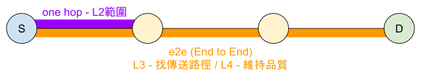

# Chapter 4 - 通訊協定

## 簡介
* 協議制定者
    * IEEE : 第一層~第二層
    * RFC : 第三層~第七層

* 資料封包的組成

## 實體層 Physical Layer
* 封包名稱 : 訊號 Signal
* 代表裝置 : 傳輸線材、中繼器、一般型集線器
* 主要功能 : 處理硬體的規格集轉換，不會知道傳輸內容

## 資料連接層 Data Link Layer
* 封包名稱 : 框架/訊框 Frame
* 代表裝置 : 橋接器、交換式集線器、網路卡
* 主要功能 : 維持一跳(one hop)間的傳輸品質

* 邏輯連接控制子層 LLC (Logical Link Control) : 用以提高傳送率(維持品質)
* 媒體存取控制子層 MAC (Midium Access Control) : 實體位置
    * CSMA/CD : 802.3 Ethernet 
    * CSMA/CA : 802.11 Wi-Fi
    > 說明 :  
    CSMA:Carrier Sense Multiple Access
    CD:Collision Detection
    CA:Collision Avoidance

## 網路層 Network Layer
* 封包名稱 : 封包 Packet
* 代表裝置 : 路由器、L3交換器
* 主要功能 : 定址(Addressing)和尋找路徑(Routing)

## 傳輸層 Transport Layer
* 封包名稱 : 片段 Segment
* 主要功能 : 維持傳輸品質
* TCP : 提供可靠的傳輸，解決封包遺失(packet lost)、失序(out of order)、重複封包(duplicate of packet)等問題
* UTP : 提供快速的傳輸

## 會議層 Session Layer
* 主要功能 : 紀錄傳輸進行到那一步驟，讓訊號恢復後可接續下去

## 呈現層 Presentation Layer
* 封包名稱：資料 Data
* 主要功能：對資料進行壓縮、解壓縮、加密和解密，將應用程式"呈現"給電腦或使用層

## 應用層 Application Layer
* 封包名稱 : 資料 Data
* 代表裝置 : 閘道器
* 主要功能 : 使用者或應用曾是與網路溝通的操作介面

## 常用的IP位置種類
* MAC Address (Physical Address) : 網卡編號(電腦的身分證)，基本上不會變動
* IP Address (Logic Address) : 通訊地址(可能會隨地點改變)
* Port Number : 區分應用程式 e.g. 80-http、443-https、24-SSH server
* Host Address : 分辨同一個伺服器中的不同網站

## 網路協定的對照

## 請求意見 RFC
* Request for Comments
* 一系列與 Internet 相關的文件
* 網路協定、演算法的建置概念
* 重要會議的紀錄與意見
