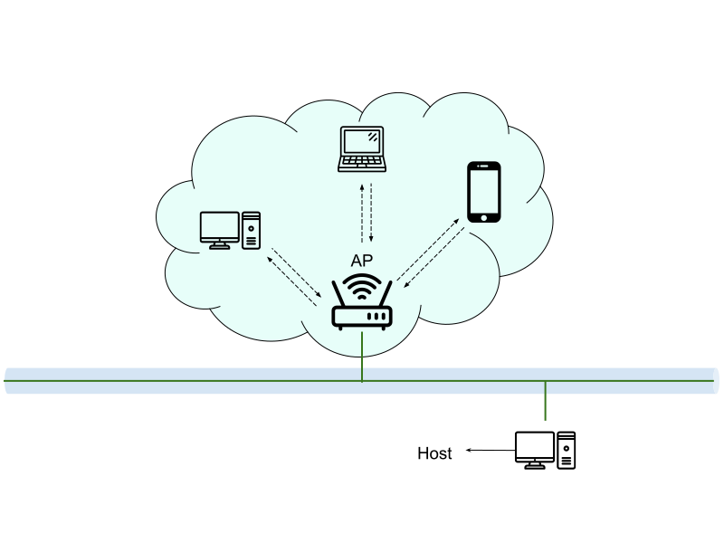

# Chapter 5 - 區域網路架設

## 乙太網路
* 歷史
    * 1960：Norman Abramson 發展 Aloha 無線電網路系統
    * 1973：Robert Metcalfe 開發第一個乙太網路（2.94Mbps）
    * 1980, 1989：美國數家公司共同制定 10Mbps 乙太網路標準
    * 1982：全錄公司公布放棄乙太網路的商業機會
    * 1987：SynOptics 發展 10Mbps 的 10BaseT 架構
    * 1992：Grand Junction 網路公司提出 100BaseT 計劃
    * 1994：100BaseT 高速乙太網路進入量產
    * 1995：制定 100BaseT 的標準規格 IEEE802.3u
    * 1998：制定 Gigabit Ethernet (超高速乙太網路) 標準規格 IEEE802.3z
    * 2002：制定 10Gbps 乙太網路標準規格 IEEE802.3ae
    * 2006：制定 10GBaseT 的標準規格 IEEE802.3an
    * 2010：制定 40Gbps、100Gbps 乙太網路標準 IEEE802.3ba
    * 2014：研定 400Gbps、1000Gbps 乙太網路標準
* 連線結構 : 樹狀結構(可以避免掉broadcast storm)
* 材料配備 : 雙絞線、RJ45接頭、RJ45護套、網路卡、撥線鉗、斜口鉗、壓線鉗、集線器和交換器等
* 連線速度
    * Ethernet : 10Mbps
    * Fast Ethernet : 100Mbps
    * Gigabit Ethernet : 1000Mbps

## 無線網路
* 無線網路分類
    * 無線廣域網路 WWAN : 智慧城市、智慧農場等遠距離連接
    * 無線區域網路 WLAN : 校園網路、工廠環境等無線環境應用
    * 無線個人網路 WPAN : 居家控制等短距離應用
* 無線網路系統
    * LoRa (Long Range) : 長距離的傳輸(速度慢,距離遠)  
    
    * 802.11 
    
    
    * 藍芽 Bluetooth : IEEE標準為 802.15.1，但是這個標準已經不再繼續使用
    
    
* 無線網路安全機制
    * 有限等效保護 WEP : 5~10位數的密碼，現今已不安全(100%可破解)
    * WiFi網路存取 WPA : 8位數的密碼，可使用暴力或字典攻擊法破解(破解難度取決於密碼難度)
    * WPA2 : 8位數的密碼，普遍使用，可使用暴力或字典攻擊法破解(破解難度取決於密碼難度)
    * WPA3 : 8位數的密碼，較新的裝置才有
* 無線網路架構
    * Ad Hoc : 對等式架構P2P
    
    * Infrastructure : 傳送都需經過AP
    
