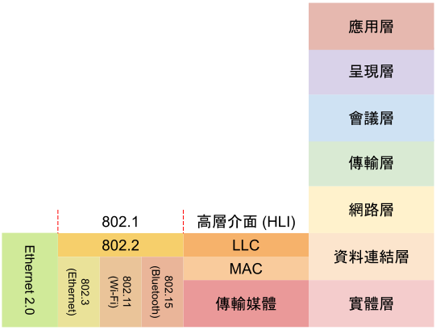
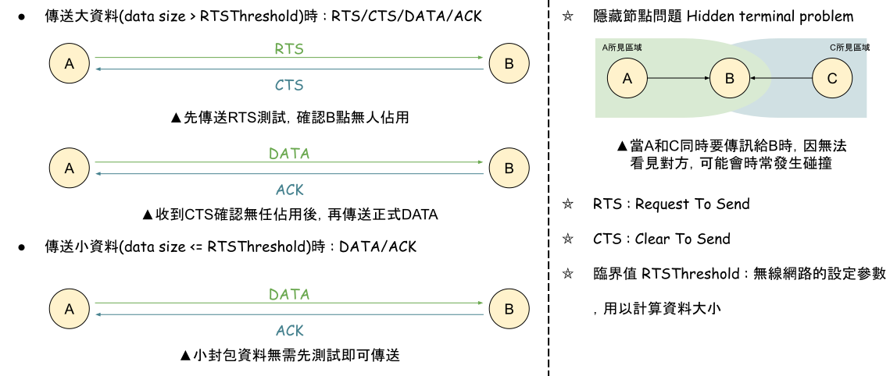
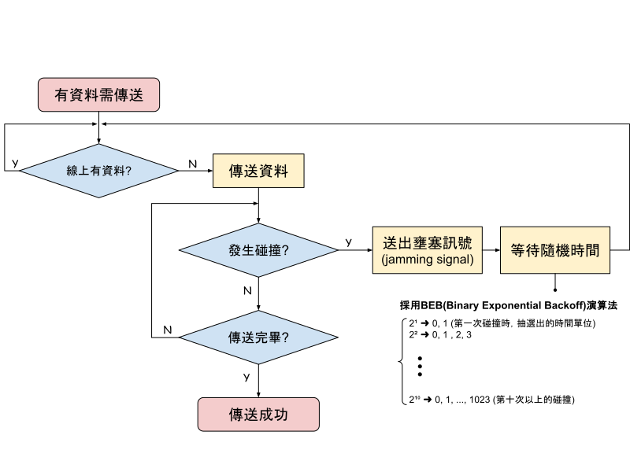
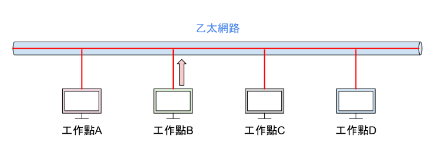
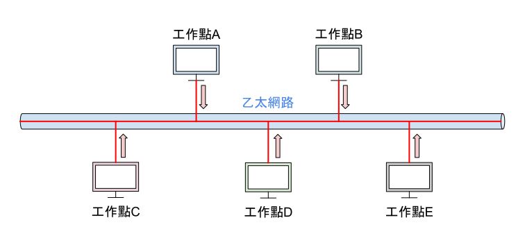
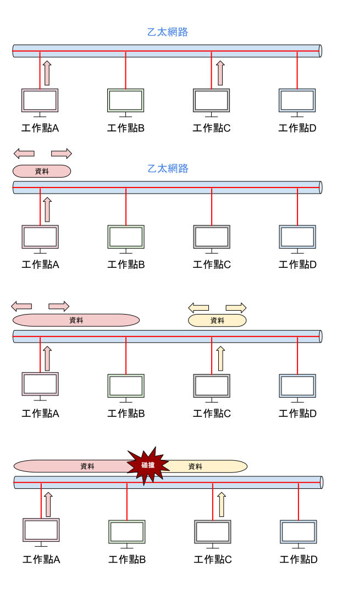
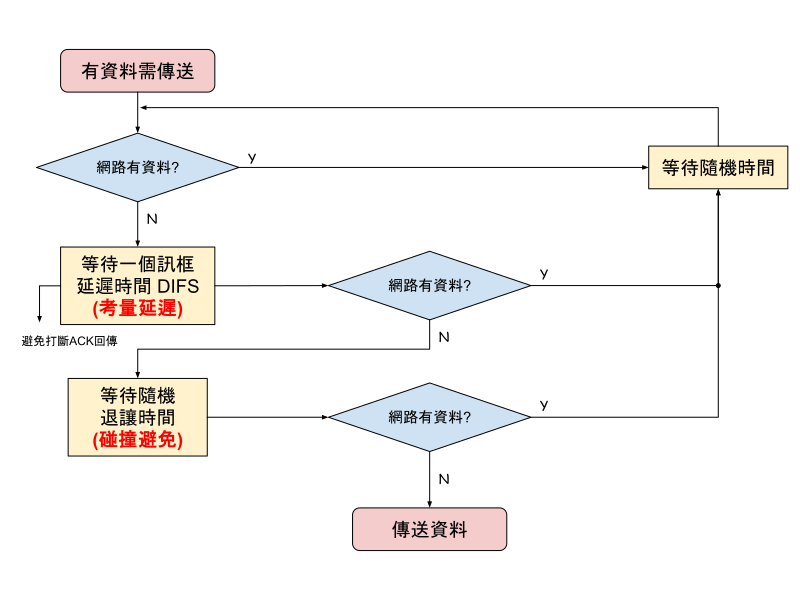

# Chapter 7 - 區域網路原理

## 電機電子工程師協會 IEEE
* 目前重要的工作群組
    * IEEE 802.3 : 規範Ethernet標準
    * IEEE 802.11 : 規範Wi-Fi標準 
    * IEEE 802.15 : 規範Bluetooth標準
* IEEE802標準語OSI之應對關係

## 無線網路傳輸
* 為了降低隱藏節點問題，通常會有兩種方式

## 載波感測多重存取/碰撞偵測 CSMA/CD
* 先聽再送，送完再聽

* 載波偵測 CS (Carrier Sense)

* 多重存取 MA (Multiple Access)

* 碰撞偵測 CD (Collision Detection)

## 載波感測多重存取/碰撞避免 CSMA/CA

## 乙太網路訊框組成
